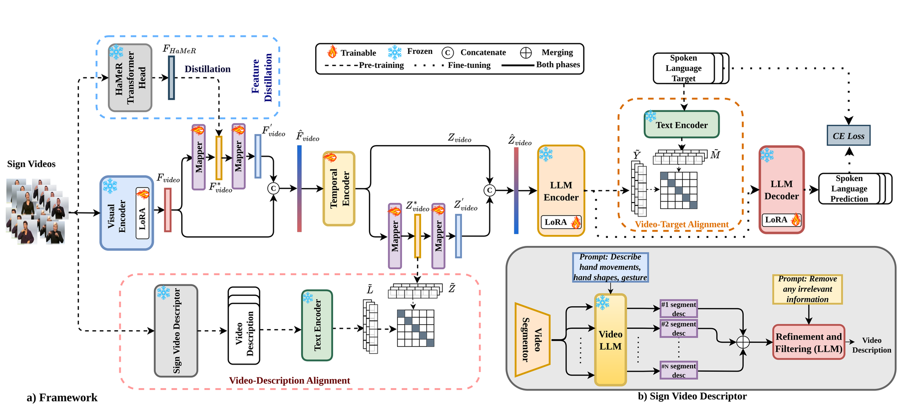

<h1 align="center">Beyond Gloss: A Hand-Centric Framework for<br>Gloss-Free Sign Language Translation</h1>

<p align="center">
  <a href="https://arxiv.org/abs/2507.23575"></a>
  <a href="LICENSE"></a>
</p>

<p align="center">
  Sobhan Asasi &nbsp;·&nbsp; Mohamed Ilyas Lakhal &nbsp;·&nbsp; Ozge Mercanoglu Sincan &nbsp;·&nbsp; Richard Bowden
  <br>
  <em>Centre for Vision, Speech and Signal Processing (CVSSP), University of Surrey</em>
</p>

<p align="center">
  
</p>

## Overview

**BeyondGloss** is a gloss-free Sign Language Translation (SLT) framework that
leverages the spatio-temporal reasoning of Video Large Language Models (VideoLLMs)
to produce fine-grained, temporally-aware descriptions of **hand motion**, and uses
them as semantic supervision while translating sign videos into spoken sentences.

Key ideas:

- **Sign Video Descriptor** — a VideoLLM (ShareGPT4Video-8B) describes hand
  movements, shapes and trajectories segment-by-segment; an LLM (GPT-4o-mini) then
  merges and refines these into a single coherent, temporally-ordered description.
- **Hand-centric distillation** — hand features from Hand Mesh Recovery (HaMeR) are
  distilled into a DINOv2 visual encoder to emphasise hand pose and orientation.
- **Contrastive alignment** — a video–description alignment aligns video features
  with the hand descriptions, and a CLIP-style video–target alignment bridges the
  gap between video and the spoken sentence, before an mBART encoder–decoder
  performs translation.

BeyondGloss achieves state-of-the-art performance on the **Phoenix14T** and
**CSL-Daily** benchmarks. See the [paper](https://arxiv.org/abs/2507.23575) for
full results and ablations.

## Repository structure

The project is split into the two stages of the framework, each with its own
detailed README:

| Component | Description |
|-----------|-------------|
| [`sign_video_descriptor/`](sign_video_descriptor/) | Generates the hand-centric textual descriptions from sign videos (VideoLLM segment description + LLM refinement). Corresponds to §3.2 / Fig. 2b. |
| [`slt_framework/`](slt_framework/) | The main SLT model: DINOv2 encoder, HaMeR distillation, temporal encoder, video–description & video–target alignment (pre-training), and the mBART translation head (fine-tuning). Corresponds to §3.1 / §3.3 / Fig. 2a. |
| [`assets/`](assets/) | Figures used in this README. |

## Getting started

The two components have separate environments and instructions:

1. **Generate descriptions** — follow [`sign_video_descriptor/README.md`](sign_video_descriptor/README.md)
   to produce a refined hand-motion description per video.
2. **Encode descriptions** into features (with mBART-large-50) and precompute the
   HaMeR hand features used for distillation.
3. **Train the SLT model** — follow [`slt_framework/README.md`](slt_framework/README.md)
   to pre-train (contrastive alignment + distillation) and then fine-tune for
   translation on Phoenix14T or CSL-Daily.

## Development

After cloning, install the git hooks once to guard against accidentally
committing secrets (API keys, tokens):

```bash
bash scripts/install-hooks.sh
```

This adds a `pre-commit` hook that scans staged changes for credential patterns
and aborts the commit if any are found (bypass with `git commit --no-verify`
only if it is a genuine false positive). Never hardcode API keys — pass them via
environment variables (e.g. `OPENAI_API_KEY`, `WANDB_API_KEY`).

## Citation

If you find this work useful, please consider citing:

```bibtex
@inproceedings{asasi2025beyondgloss,
  title     = {Beyond Gloss: A Hand-Centric Framework for Gloss-Free Sign Language Translation},
  author    = {Asasi, Sobhan and Lakhal, Mohamed Ilyas and Mercanoglu Sincan, Ozge and Bowden, Richard},
  booktitle = {Proceedings of the British Machine Vision Conference (BMVC)},
  year      = {2025}
}
```

## Acknowledgements

This project builds on a number of excellent open-source works:

- [Sign2GPT](https://github.com/ryanwongsa/Sign2GPT) — our codebase and DINOv2-based visual encoder build on this gloss-free SLT work (ICLR 2024).
- [Hands-On](https://github.com/JianHe0628/Hands-On) — our HaMeR hand-feature extraction builds on this sign-language segmentation work (FG 2025), which first applied HaMeR to sign language.
- [GFSLT-VLP](https://github.com/zhoubenjia/GFSLT-VLP) — our mBART-based CLIP-style pre-training and translation setup builds on this gloss-free SLT work (ICCV 2023).
- [PyTorch Lightning](https://github.com/Lightning-AI/pytorch-lightning) — training framework.

## License

Released under the [MIT License](LICENSE).
