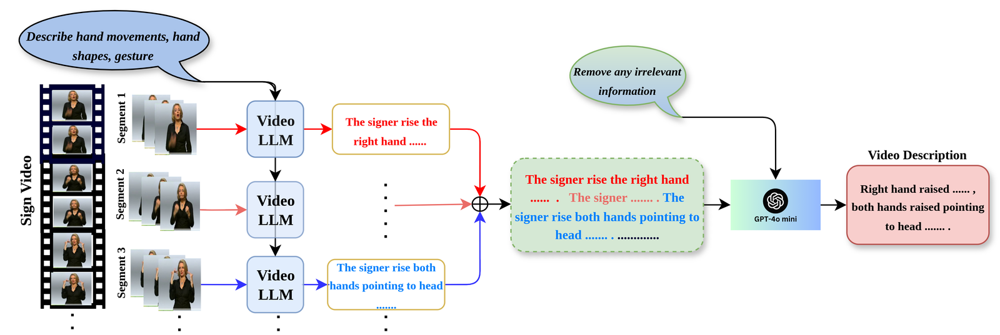

# Sign Video Descriptor

This module implements the **Sign Video Descriptor** from *Beyond Gloss: A
Hand-Centric Framework for Gloss-Free Sign Language Translation* (Section 3.2).
It generates fine-grained, temporally-aware textual descriptions of hand motion
for each sign-language video. These descriptions are used as high-level semantic
supervision during the pre-training stage of the BeyondGloss framework
(video–description alignment).

<p align="center">
  
</p>

## 🔄 Pipeline

The descriptor works in two stages:

1. **Segment-level description (VideoLLM)** — `describe_segments.py`
   Each video is split into non-overlapping **16-frame** segments. Every segment
   is arranged as a single grid image and passed to **ShareGPT4Video-8B** with a
   hand-centric prompt, producing a per-segment description of hand position,
   movement, shape and trajectory. Output: one JSON per video with `chunk_0`,
   `chunk_1`, ... fields.

2. **Merge & refine (LLM)** — `refine.py`
   The segment descriptions are concatenated in temporal order and passed to
   **GPT-4o-mini**, which removes irrelevant content (people, background,
   colours, facial expression) and returns a single coherent sentence,
   preserving temporal order. Output: the same JSON with an added `refined`
   field.

`describe_single_video.py` runs Stage 1 on a single video file for quick
inspection. `prepare_shards.py` splits a dataset into shards for parallel runs.

## ⚙️ Setup

Stage 1 depends on the ShareGPT4Video / LLaVA code and the ShareGPT4Video-8B
checkpoint:

```bash
git clone https://github.com/ShareGPT4Omni/ShareGPT4Video
conda create -n share4video python=3.10 -y
conda activate share4video
cd ShareGPT4Video
pip install -e .
pip install flash-attn --no-build-isolation
pip install decord openai tqdm
```

Place the scripts in this directory on your `PYTHONPATH` (or copy them into the
ShareGPT4Video repo root) so that `import llava.*` resolves. The checkpoint is
downloaded automatically from `Lin-Chen/sharegpt4video-8b`, or pass a local path
via `--model-path`.

For Stage 2, provide your OpenAI key via the environment (never commit it):

```bash
export OPENAI_API_KEY="sk-..."
```

## ▶️ Usage

Input frames are expected as one subdirectory per video, each holding the
extracted frames as `.png`/`.jpg` (frame extraction is dataset-specific and not
included here).

```bash
# (optional) split the dataset into shards for parallel processing
python prepare_shards.py \
    --frames_dir       /path/to/frames \
    --descriptions_dir /path/to/descriptions \
    --output_dir       /path/to/shards

# Stage 1: per-segment descriptions with the VideoLLM
python describe_segments.py \
    --json_path   /path/to/shards/chunk_1.json \
    --main_dir    /path/to/frames \
    --output_dir  /path/to/descriptions

# Stage 2: merge and refine with GPT-4o-mini
python refine.py \
    --input_dir  /path/to/descriptions \
    --output_dir /path/to/refined

# single-video demo
python describe_single_video.py --video /path/to/video.mp4
```

Both stages are resumable — videos with an existing output JSON are skipped.

`scripts/` contains a minimal launcher and an example SLURM submission file for
running Stage 1 across shards on a cluster (adjust to your site).

## 🙏 Acknowledgements

Stage 1 builds on [ShareGPT4Video](https://github.com/ShareGPT4Omni/ShareGPT4Video)
(NeurIPS 2024) and the [LLaVA](https://github.com/haotian-liu/LLaVA) codebase.
